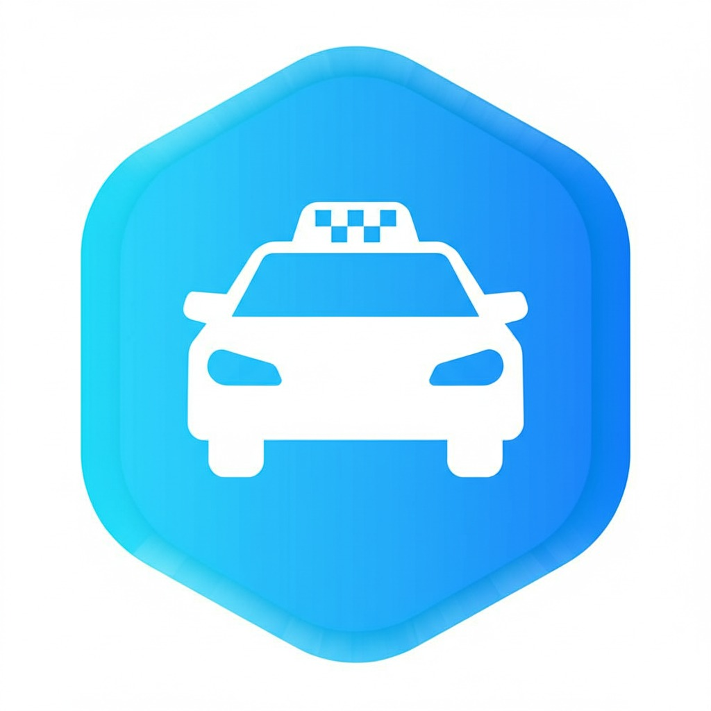
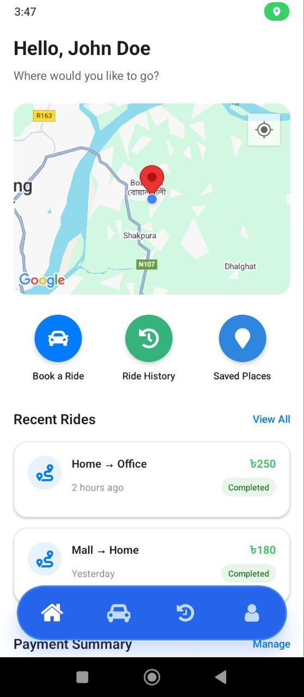
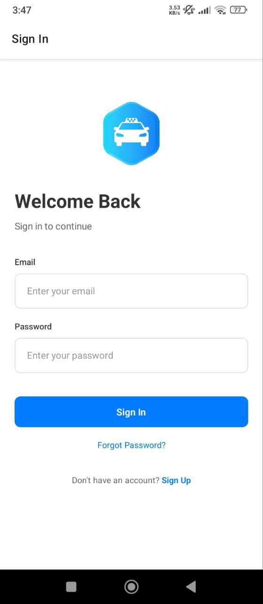
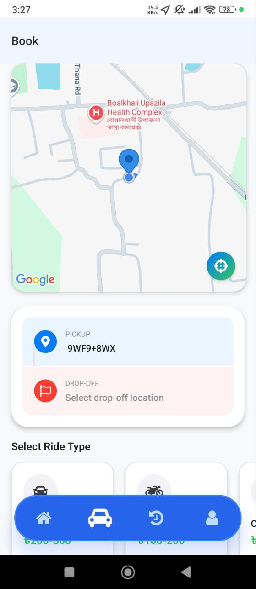
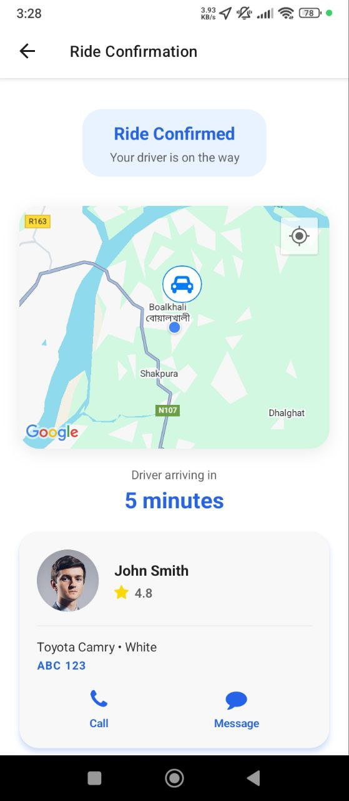
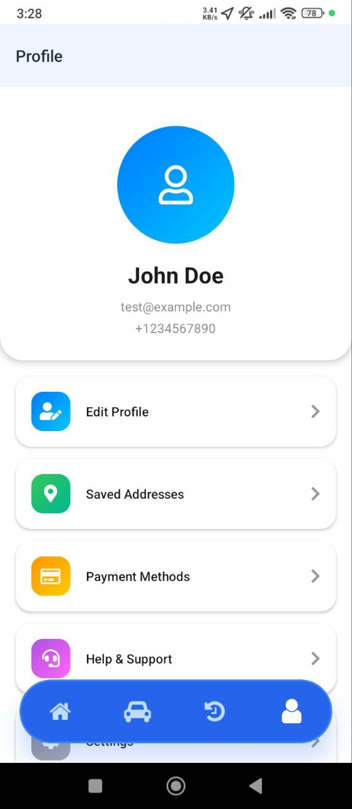
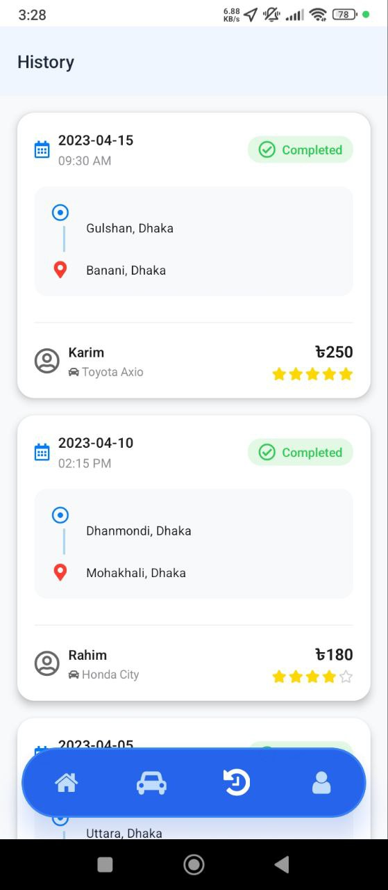
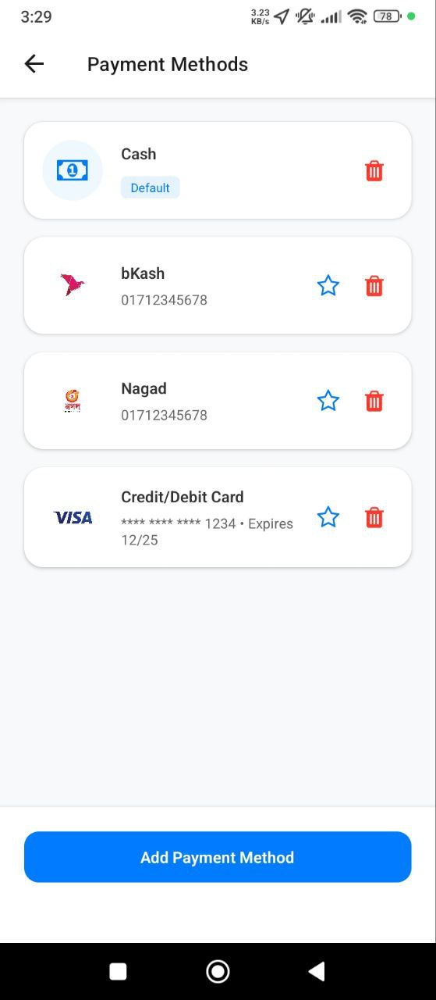
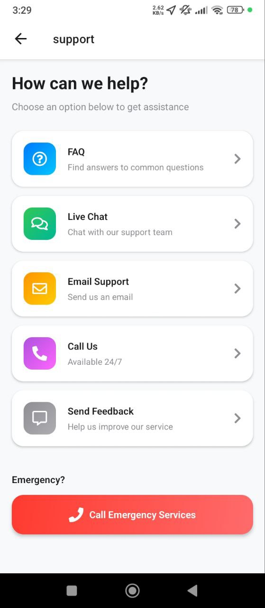

# 🚗 Ryde: Bangladesh Ride-Sharing App  
*Project Proposal for Investors*

---

## Executive Summary

Ryde is a modern, mobile-first ride-sharing platform designed for Bangladesh. Our mission is to provide safe, reliable, and affordable transportation for millions, leveraging local payment methods, real-time tracking, and a seamless user experience. With a focus on both urban and suburban mobility, Ryde is positioned to become the go-to app for daily commutes and travel.

---

## Vision

To revolutionize urban mobility in Bangladesh by making ride-hailing accessible, secure, and efficient for everyone.

---

## Product Overview

- **Platform:** Mobile (iOS & Android, built with Expo/React Native)
- **Status:** Interactive prototype (all screens implemented, ready for demo)
- **Target Market:** Bangladesh (Dhaka, Chittagong, and major cities)
- **Monetization:** Ride commissions, promotions, and partnerships

---

## Features & Screens

### 1. Onboarding & Welcome
A beautiful, friendly introduction to the Ryde app, highlighting key benefits and guiding new users through the setup process.

---

### 2. Login / Signup
Secure authentication with phone, email, or Google. Includes OTP verification for maximum security and a smooth onboarding experience.

---

### 3. Home / Map
The main dashboard with a real-time map, quick actions, and personalized greeting. Users can easily start booking a ride, view recent rides, and access promotions.

---

### 4. Book a Ride
Intuitive ride booking with pickup/drop-off selection, ride type options (Car, Bike, CNG, Premium), fare estimation, and scheduling.

---

### 5. Ride Confirmation & Live Tracking
After booking, users see live driver tracking, ETA, and ride status updates. The design is clean, with all key info at a glance.

---

### 6. Driver Details & Contact
Detailed driver card with photo, rating, car info, and quick access to call or message the driver for a safe, connected experience.

---

### 7. Ride History
A comprehensive list of past rides, including trip details, status, and the ability to view receipts or repeat bookings.

---

### 8. Profile & Settings
Manage personal information, saved addresses, and app preferences. Users can update their profile photo, contact info, and more.

---

### 9. Payment Methods
Add, remove, or manage payment options including Cash, bKash, Nagad, and cards. Secure and easy to use.

---

### 10. Support & FAQ
Access help, FAQs, and contact support directly from the app. Ensures users always have assistance when needed.

---

## Technology Stack

- **Frontend:** React Native (Expo)
- **Navigation:** Expo Router, React Navigation
- **Maps:** Google Maps API (mocked for demo)
- **State Management:** React Context, useReducer
- **Styling:** Custom, responsive, and accessible UI
- **Testing:** Jest, React Native Testing Library

---

## Business Model

- **Commission per ride**
- **Promoted rides and in-app advertising**
- **Subscription for premium features (future roadmap)**

---

## Competitive Advantages

- Localized for Bangladesh (language, payments, ride types)
- Modern, intuitive UI/UX
- Scalable, cross-platform codebase
- Ready for rapid deployment and iteration

---

## Next Steps

- Integrate with real backend and payment APIs
- Launch pilot in Dhaka and Chittagong
- Expand driver and user acquisition campaigns

---

## Contact

**For investment, partnership, or demo requests:**  
- [Your Name]  
- [Your Email]  
- [Your Phone/WhatsApp]  
- [Your Company/Startup Name]

---

*Thank you for considering Ryde. Together, we can transform mobility in Bangladesh!*
